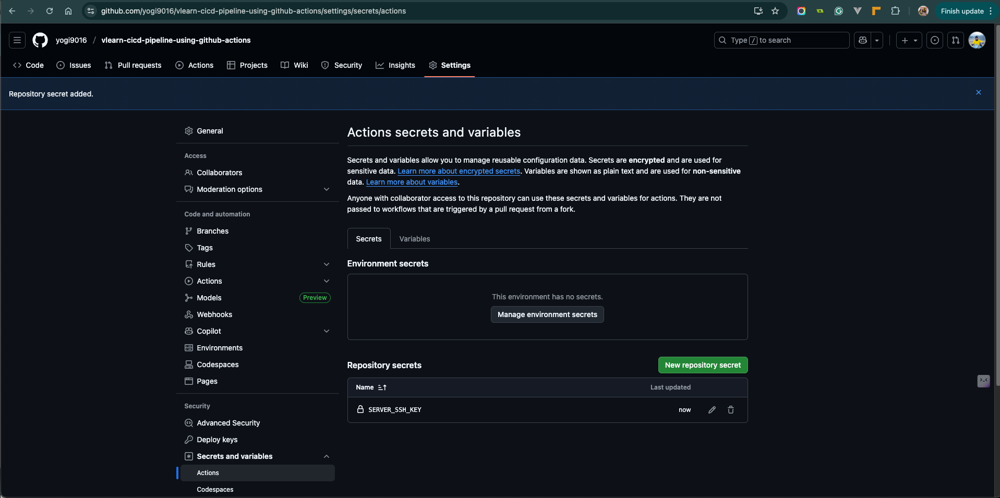
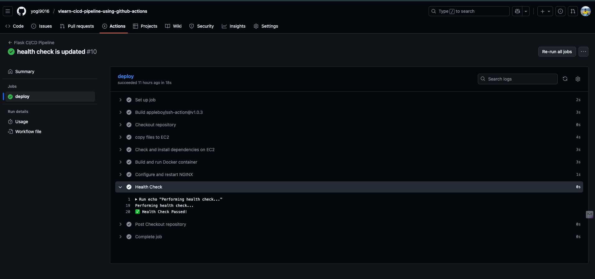
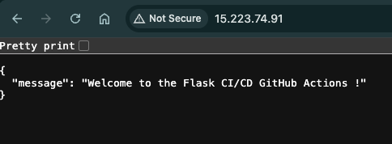

# Flask CI/CD with GitHub Actions

This repository demonstrates a **CI/CD pipeline for a Flask application** using **GitHub Actions** and **AWS EC2 deployment with Docker and NGINX**.

---

## Project Overview

The goal of this project is to automate the **build, test, and deployment** workflow for a Flask application.
Every push to the main branch triggers a **GitHub Actions** pipeline that deploys the latest version of the app to an EC2 server where Docker runs the app behind **NGINX**.

The Flask app exposes a simple API:

```bash
GET /
Response: { "message": "Welcome to the Flask CI/CD GitHub Actions !" }
```

---

## Features

- Fully automated **CI/CD pipeline** via GitHub Actions
- Automated dependency installation on EC2  
- **Dockerized** Flask application  
- **NGINX reverse proxy** for production traffic  
- **Health check** to verify deployment  
- Secure deployment using **GitHub Secrets**

---

## Architecture

```
GitHub Actions
      |
      v
EC2 Server (Ubuntu)
  ├─ Docker container running Flask app
  └─ NGINX reverse proxy forwarding port 80
```

---

## GitHub Actions Workflow

The workflow is located at:  
```.github/workflows/flask-cicd.yml```

### Workflow Steps

1. **Checkout repository** – clone or pull the latest code.  
2. **Copy files to EC2** – Copy files to remote server using scp-action@v1.  
3. **Install Dependencies** – ensure Docker, NGINX, and Git are installed on remote server.  
4. **Build & Run Docker Container** – build the Docker image and run the container.  
5. **Configure NGINX** – copy `nginx.conf` and restart NGINX.  
6. **Health Check** – verify the app is reachable on port 80.  

---

## Environment Variables & Secrets

Store the following secrets in **GitHub**:

| Secret                  | Description                          |
|-------------------------|--------------------------------------|
| `SERVER_HOST`           | EC2 public IP                        |
| `SERVER_USERNAME`       | EC2 username (usually `ubuntu`)      |
| `SERVER_SSH_KEY`        | Private SSH key for EC2 access       |



Workflow environment variables:

```yaml
APP_NAME: flask-cicd-demo
APP_DIR: /home/ubuntu/vlearn-cicd-pipeline-using-github-actions
GIT_REPO: https://github.com/yogi9016/vlearn-cicd-pipeline-using-github-actions.git
GIT_BRANCH: main
DOCKER_IMAGE: flask-cicd-actions:latest
CONTAINER_NAME: cicd-actions-container
APP_PORT: 5001
```

---

## 🚀 Deployment Process

- Push changes to the main branch.

- GitHub Actions triggers automatically.

- The workflow connects to the EC2 instance, builds the Docker image, and redeploys the app.

- NGINX serves the new build on port 80.


---

## 🩺 Health Check

A health check step validates the deployed application by making a curl request to the EC2 public IP. If HTTP 200 is returned, the deployment is considered successful.



## 🧩 Conclusion

This project successfully automates the CI/CD lifecycle of a Flask web application using GitHub Actions and AWS EC2. With Docker ensuring consistent deployments and NGINX handling production traffic, this setup provides a scalable, secure, and maintainable deployment pipeline.

It demonstrates how continuous integration and continuous deployment can streamline development, reduce manual effort, and ensure reliable software delivery.

---

💡 *Author: [Yogeswaaran Selvam](https://github.com/yogi9016)*  
📧 *Contact: yogi9016@gmail.com*